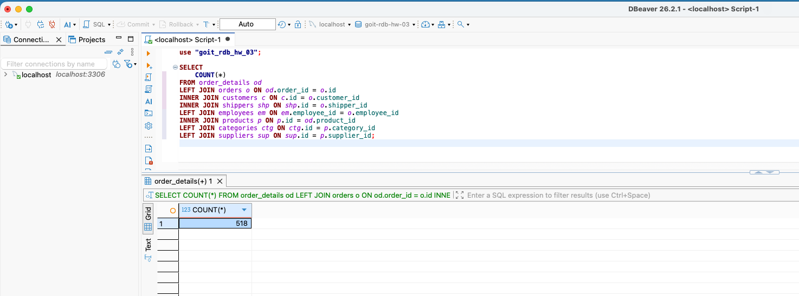

# SQL Join Analysis: INNER vs LEFT JOIN

## Task Explanation

When switching from `INNER JOIN` to `LEFT JOIN` in the query, the quantity of rows remained unchanged. This occurred because all records in the `order_details` table have matching records in all joined tables (`orders`, `customers`, `shippers`, `employees`, `products`, `categories`, `suppliers`).

With complete referential integrity, `LEFT JOIN` behaves identically to `INNER JOIN` as there are no unmatched rows to include, so the result set remains the same.

**Screenshot of the result**

## Key Insight

- **INNER JOIN**: Returns only rows with matches in ALL tables
- **LEFT JOIN**: Returns ALL rows from the left table, with NULLs for unmatched right table rows
- **Result**: When all relationships exist, both produce identical output